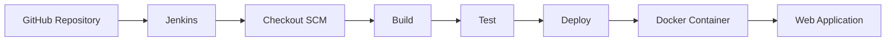

````markdown
# 🚀 Task 2 — Jenkins CI/CD Pipeline with Docker


> A practical DevOps internship project demonstrating how **Jenkins and Docker** can be used to automate the build, test, and deployment of a simple web application.

---

## 📌 Table of Contents

- [🎯 Project Overview](#-project-overview)
- [🛠️ Tools Used](#️-tools-used)
- [📁 Project Structure](#-project-structure)
- [🏗️ Project Architecture](#️-project-architecture)
- [🔄 CI/CD Pipeline Flow](#-cicd-pipeline-flow)
- [🐳 Docker Configuration](#-docker-configuration)
- [⚙️ Jenkins Pipeline](#️-jenkins-pipeline)
- [🔔 Automated Trigger](#-automated-trigger)
- [▶️ Application Deployment](#️-application-deployment)
- [🧪 Testing & Verification](#-testing--verification)
- [📸 Evidence](#-evidence)
- [⚠️ Issues Encountered & Fixes](#️-issues-encountered--fixes)
- [🎓 What I Learned](#-what-i-learned)
- [🧠 Key Concepts](#-key-concepts)
- [📋 Project Status](#-project-status)
- [🏁 Conclusion](#-conclusion)

---

## 🎯 Project Overview

The objective of this project was to create a basic **Jenkins CI/CD pipeline** that automates the process of building, testing, and deploying a Dockerized web application.

The project demonstrates how Jenkins can:

- Retrieve source code from GitHub
- Execute a Docker build
- Verify the generated Docker image
- Deploy the application using a Docker container
- Organize the workflow into separate pipeline stages
- Monitor GitHub repository changes using SCM polling

---

## 🛠️ Tools Used

| Tool / Technology | Purpose |
| ----------------- | ------- |
| **Jenkins** | CI/CD automation |
| **Docker** | Containerization and deployment |
| **Git** | Version control |
| **GitHub** | Remote source-code repository |
| **Nginx** | Web server inside the Docker container |
| **HTML** | Simple web application |
| **VS Code** | Project development and configuration |
| **Java 21** | Jenkins runtime |

---

## 📁 Project Structure

```text
Task-2-jenkins-cicd/
│
├── 📄 Dockerfile
├── 📄 Jenkinsfile
├── 📄 index.html
├── 📄 README.md
│
└── 📂 screenshots/
    ├── 📸 Jenkins pipeline
    ├── 📸 Deployed application
    └── 📸 Poll SCM configuration
````

### File Purpose

| File / Folder  | Purpose                                |
| -------------- | -------------------------------------- |
| `Dockerfile`   | Defines the Docker image configuration |
| `Jenkinsfile`  | Defines the Jenkins CI/CD pipeline     |
| `index.html`   | Simple web application                 |
| `README.md`    | Project documentation                  |
| `screenshots/` | Evidence of pipeline and deployment    |

---

## 🏗️ Project Architecture

```text
                    ┌─────────────────────┐
                    │   GitHub Repository │
                    │  Source Code +      │
                    │    Jenkinsfile      │
                    └──────────┬──────────┘
                               │
                               ▼
                    ┌─────────────────────┐
                    │       Jenkins       │
                    │    CI/CD Pipeline   │
                    └──────────┬──────────┘
                               │
                 ┌─────────────┼─────────────┐
                 ▼             ▼             ▼
             Checkout        Build          Test
                 │             │             │
                 │             ▼             │
                 │       Docker Image        │
                 │             │             │
                 └─────────────┼─────────────┘
                               ▼
                           Deploy
                               │
                               ▼
                    ┌─────────────────────┐
                    │   Docker Container  │
                    │      Nginx          │
                    └──────────┬──────────┘
                               │
                               ▼
                    http://localhost:8080
```

---

## 🔄 CI/CD Pipeline Flow



### Pipeline Stages

```text
Checkout SCM
      ↓
Build
      ↓
Test
      ↓
Deploy
      ↓
Docker Container
      ↓
Web Application
```

---

## 🐳 Docker Configuration

The application is packaged into a lightweight Docker image using **Nginx Alpine**.

### Dockerfile

```dockerfile
FROM nginx:alpine
COPY index.html /usr/share/nginx/html/index.html
```

### Explanation

* `FROM nginx:alpine` uses a lightweight Nginx image.
* `COPY` places the HTML application inside the Nginx web directory.
* Nginx serves the application through port `80` inside the container.

The application is exposed locally through:

```text
http://localhost:8080
```

The port mapping is:

```text
Host Port 8080 → Container Port 80
```

---

## ⚙️ Jenkins Pipeline

The CI/CD workflow is defined in the `Jenkinsfile`.

### Pipeline Stages

### 1. Checkout SCM

Jenkins retrieves the project source code from the GitHub repository.

```text
GitHub → Jenkins Workspace
```

### 2. Build

Jenkins builds the Docker image:

```bash
docker build -t task-2-jenkins-cicd .
```

### 3. Test

The pipeline verifies that the Docker image was successfully created:

```bash
docker image inspect task-2-jenkins-cicd
```

### 4. Deploy

The Docker container is started:

```bash
docker run -d --name task2-app -p 8080:80 task-2-jenkins-cicd
```

After deployment, the application becomes available at:

```text
http://localhost:8080
```

---

## 📜 Jenkinsfile

The project uses a **Declarative Jenkins Pipeline**.

```groovy
pipeline {
    agent any

    stages {
        stage('Build') {
            steps {
                bat 'docker build -t task-2-jenkins-cicd .'
            }
        }

        stage('Test') {
            steps {
                bat 'docker image inspect task-2-jenkins-cicd'
            }
        }

        stage('Deploy') {
            steps {
                bat 'docker run -d --name task2-app -p 8080:80 task-2-jenkins-cicd'
            }
        }
    }
}
```

The Jenkins job uses:

```text
Pipeline script from SCM
```

with the GitHub repository as the source.

---

## 🔔 Automated Trigger

Jenkins was configured with **Poll SCM** to periodically check the GitHub repository for source-code changes.

The configured schedule was:

```text
H/1 * * * *
```

This means Jenkins checks the repository approximately once per minute according to Jenkins' hashed scheduling mechanism.

### Trigger Configuration

```text
GitHub Repository
       ↓
    Poll SCM
       ↓
Change Detected
       ↓
Jenkins Pipeline
```

> **Note:** Poll SCM was configured as the automated trigger mechanism. The project evidence focuses on the configured trigger and the successful manual pipeline execution.

---

## ▶️ Application Deployment

The application was deployed locally using Docker through the Jenkins pipeline.

### Application URL

```text
http://localhost:8080
```

### Expected Output

```text
Jenkins CI/CD Pipeline

Deployment successful!
```

The deployed web page was successfully verified in the browser.

---

## 🧪 Testing & Verification

The Jenkins pipeline was successfully executed with the following stages:

| Stage        | Result    |
| ------------ | --------- |
| Checkout SCM | ✅ Success |
| Build        | ✅ Success |
| Test         | ✅ Success |
| Deploy       | ✅ Success |

### Jenkins Result

```text
Finished: SUCCESS
```

### Docker Verification

The Docker deployment was verified by opening:

```text
http://localhost:8080
```

The browser displayed:

```text
Jenkins CI/CD Pipeline
Deployment successful!
```

This confirmed that the Docker container was serving the web application successfully.

---

## 📸 Evidence

The `screenshots/` directory contains evidence of the completed project.

| Evidence                 | Description                                                        |
| ------------------------ | ------------------------------------------------------------------ |
| `Jenkins pipeline`       | Checkout SCM, Build, Test and Deploy stages completed successfully |
| `Deployed application`   | Web application successfully running on `localhost:8080`           |
| `Poll SCM configuration` | Jenkins SCM polling configuration                                  |

The screenshots provide visual verification of the Jenkins pipeline, Docker deployment, and trigger configuration.

---

## ⚠️ Issues Encountered & Fixes

### 1. Jenkins Java Version Requirement

Initially, Java 8 was available on the system.

Jenkins required a newer supported Java version, so **Eclipse Temurin JDK 21** was installed and configured.

Verification:

```bash
java -version
```

The terminal was then updated to use Java 21.

---

### 2. Jenkins Optional Plugin Installation

During the Jenkins setup, some optional plugins such as:

```text
Email Extension
LDAP
```

failed to install.

The important plugins required for the project, including Pipeline and Git-related functionality, were successfully installed.

The project continued successfully because those optional plugins were not required for the basic CI/CD pipeline.

---

### 3. Git Push Connection Error

While pushing the README changes to GitHub, the following error occurred:

```text
error: RPC failed; curl 35 Recv failure: Connection was reset
send-pack: unexpected disconnect while reading sideband packet
fatal: the remote end hung up unexpectedly
```

Git status was then checked:

```bash
git status
```

It showed:

```text
Your branch is ahead of 'origin/main' by 1 commit.
```

The push was retried successfully and the changes appeared in the GitHub repository.

### Key Takeaway

A temporary network connection reset during `git push` does not necessarily mean that the local commit is lost. Checking `git status` helps determine whether the commit still needs to be pushed.

---

## 🧠 Key Concepts

### CI

**Continuous Integration** means frequently integrating code changes into a shared repository and automatically validating them.

### CD

**Continuous Delivery/Deployment** automates the process of preparing or deploying an application after successful validation.

### Jenkins

Jenkins is an automation server commonly used to implement CI/CD pipelines.

### Jenkinsfile

A `Jenkinsfile` is a text file stored with the source code that defines the Jenkins pipeline as code.

### Docker Image

A Docker image is a packaged template used to create containers.

### Docker Container

A container is a running instance of a Docker image.

### SCM

SCM stands for **Source Code Management**. In this project, GitHub is used as the source-code repository.

### Poll SCM

Poll SCM allows Jenkins to periodically check the source repository for changes.

---

## 🎓 What I Learned

Through this project, I learned and practiced:

* Jenkins installation and basic configuration
* Jenkins Pipeline creation
* Declarative Jenkinsfile structure
* Pipeline stages
* GitHub integration with Jenkins
* Pipeline script from SCM
* Docker image creation
* Docker image verification
* Docker container deployment
* Port mapping
* SCM polling
* CI/CD workflow
* Troubleshooting Jenkins and Git issues
* Verifying deployments through a browser

---

## 🧠 Key Interview Points

### What is Jenkins?

Jenkins is an open-source automation server used to automate software development processes such as build, test, and deployment.

### What is a Jenkinsfile?

A Jenkinsfile defines the Jenkins pipeline as code and can be stored inside the project's source-code repository.

### What stages were used in this project?

```text
Checkout SCM → Build → Test → Deploy
```

### Why was Docker used?

Docker was used to package and deploy the web application in a consistent containerized environment.

### What is the difference between an image and a container?

A Docker **image** is the packaged template, while a **container** is a running instance created from that image.

### What is Declarative Pipeline?

Declarative Pipeline is a structured Jenkins pipeline syntax that defines the pipeline using blocks such as:

```text
pipeline
agent
stages
stage
steps
```

### What is Poll SCM?

Poll SCM periodically checks the configured source repository for changes and can trigger a new Jenkins build when changes are detected.

---

## 📋 Project Status

| Requirement            | Status     |
| ---------------------- | ---------- |
| Jenkins setup          | ✅ Complete |
| Java 21 configuration  | ✅ Complete |
| Docker setup           | ✅ Complete |
| GitHub repository      | ✅ Complete |
| Jenkinsfile            | ✅ Complete |
| Pipeline from SCM      | ✅ Complete |
| Checkout SCM           | ✅ Success  |
| Build stage            | ✅ Success  |
| Test stage             | ✅ Success  |
| Deploy stage           | ✅ Success  |
| Docker deployment      | ✅ Verified |
| Poll SCM configuration | ✅ Complete |
| README.md              | ✅ Complete |
| Evidence screenshots   | ✅ Added    |
| GitHub push            | ✅ Complete |
| Final verification     | ✅ Complete |

---

## 🏁 Conclusion

This project demonstrates a practical **Jenkins + Docker CI/CD workflow**.

The source code is maintained in GitHub, Jenkins retrieves the project through SCM, builds the Docker image, verifies the image, and deploys the application using a Docker container.

The final deployment was successfully verified through the browser at:

```text
http://localhost:8080
```

The project provides practical exposure to the core CI/CD workflow used in DevOps environments.

---

## 🚀 Final Project

**Task:** Task 2 — Create a Simple Jenkins Pipeline for CI/CD

**Repository:** `Task-2-jenkins-cicd`

**Status:** ✅ Completed

**GitHub Repository:**

[https://github.com/nileshyadav2803/Task-2-jenkins-cicd](https://github.com/nileshyadav2803/Task-2-jenkins-cicd)
